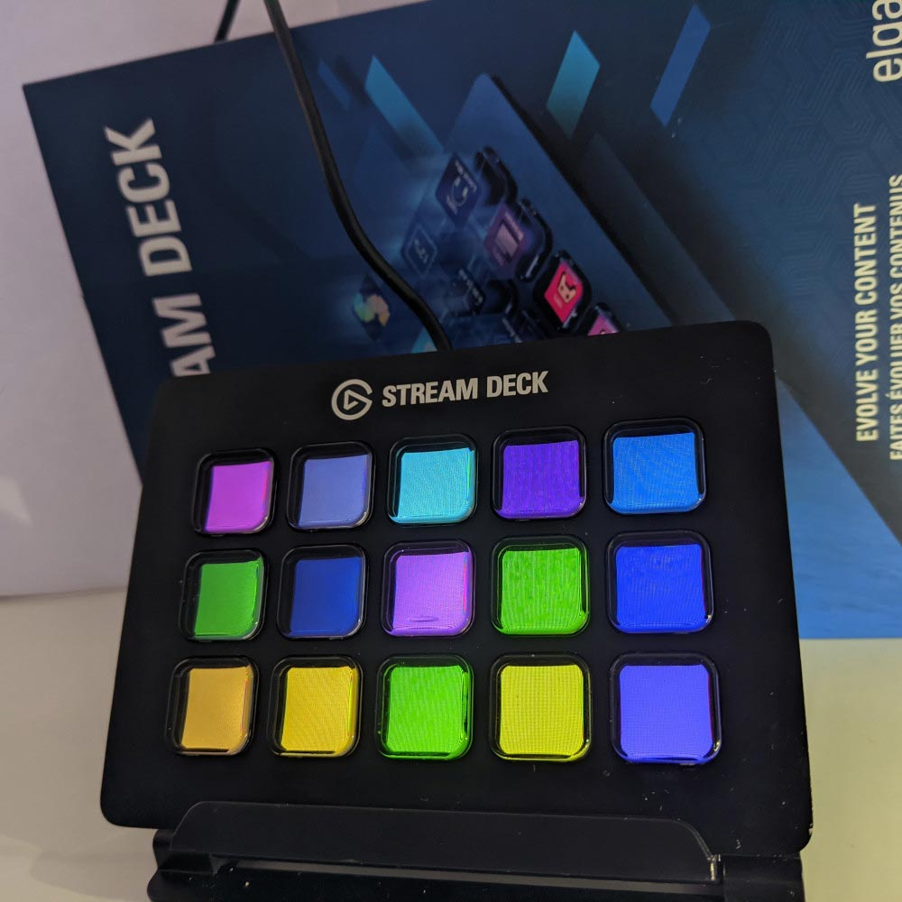
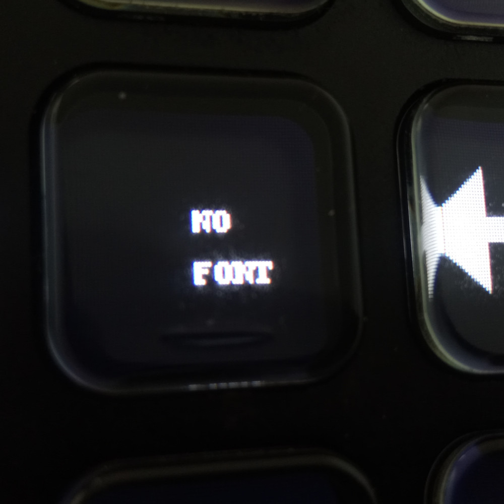
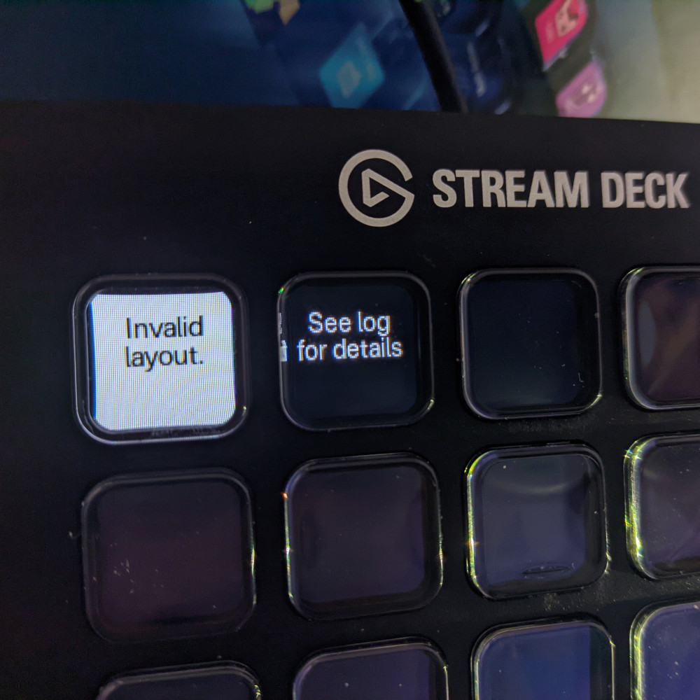
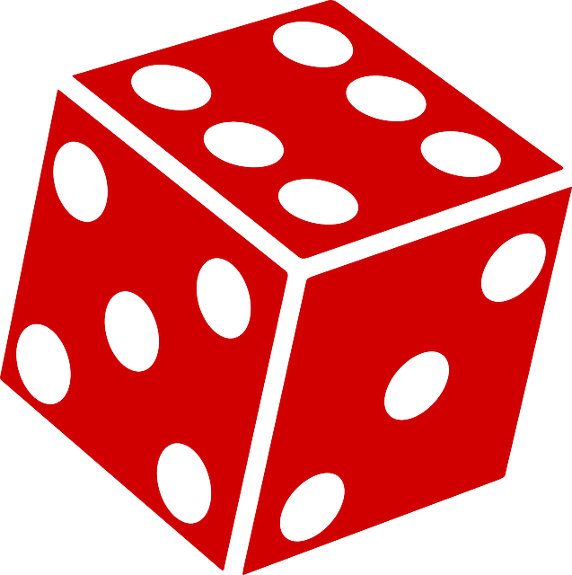

# Stream Deck Controller

A Linux compatiable software for the Elgato Stream Deck with plugin support.

_________________



---

## Installation

    1. Download the latest [release](https://github.com/TriLinder/StreamDeckController/releases)

    2. Decompress the archive into a new directory

    3. Install all the required modules from `requirements.txt`

    4. Install the `streamdeck` module according to their [documentation](https://python-elgato-streamdeck.readthedocs.io/en/stable/pages/installation.html)

    5. Download a font of your choice and place it into the `fonts` directory

    6. Open `config.json` and modify `font` to the name of your font of choice.

    7. Run `main.py`

You should be asked to select your device from a list. If you can't see your device, make sure you installed the `streamdeck` module correctly and consider rebooting.

---

## Demo

If you're using the 15 button Stream Deck (the one in the picture above), you will be presented with a demo. Enjoy!

---

## Troubleshooting



If you're presented with a screen like this, you haven't installed the font correctly. Please double-check that the font file is either a `.ttf` or a `.otf` and its in the correct directory.

Then check that you entered the right name into `config.json`.

If you still can't get your font to work, try another font or create an issue here on GitHub.

---



This error screen means the page you're trying to load is made for a different Stream Deck model. If you see this on the first start, you're probably not using the 15 button model and so can't use the demo. Don't worry however as you can still use your own profiles as is explained below.

---

## Creating your own profiles

This is the fun part.

‏‏‎ ‎

Under the `pages` directory you can find `empty.json`. Use this as a template for your first page.

```json
{
    "images": ["blank"],
    "ticks": [],
    "dimensions": "5x3",
    "created": 1646871751,

    "buttons": {
    }
}
```

First, let's start with editing the `dimensions` key. This is used to determine whether or not a page is suitable for the connected Stream Deck. It's in the simple format of `Width X Hight`, so the 15 button Stream Deck in the pictures above has the dimensions of `5x3`. Set this to your Stream Deck's dimensions.

‏‏‎ ‎

The `created` key is a [UNIX timestmap](https://en.wikipedia.org/wiki/Unix_time) and while it's not currently used by the program, I still recommend setting it as it may be used in a future version.

‏‏‎ ‎

We'll get to the `images` and `ticks` keys later.

‏‏

---

### Adding buttons

Now let's add some buttons.

First, however, let's look at coordinates.

| 0x0 | 1x0 | 2x0 | 3x0 | 4x0 |
|:---:| --- | --- | --- | --- |
| 0x1 | 1x1 | 2x1 | 3x1 | 4x1 |
| 0x2 | 1x2 | 2x2 | 3x2 | 4x2 |

These are the coordinates for the 15 button Stream Deck. As you can see, the coordinates are in the format of  `x/y` with the top left button being  `0x0`.

‎

You can always bring the coordinates up with the `showCoords` action, which we'll talk about later.

‎

Now that you know how to work with the coordinates, we can add our first button.

This is how our `empty.json` template looks with a new button.

```json
{
    "images": ["blank"],
    "ticks": [],
    "dimensions": "5x3",
    "created": 1646871751,

    "buttons": {
        "0x0" : {"caption":"Hello,\nworld.", "fontSize":12, "color":"white", "fontAlignment":"center", "background":"blank", "actions":{"none":""}}
    }
}
```

Let's examine our button a little closer.

```json
"0x0" : {"caption":"Hello,\nworld.",
        "fontSize":12, 
        "color":"white", 
        "fontAlignment":"center", 
        "background":"blank", 
        "actions":{
                    "none":""
                  }
}
```

The button is under the key `0x0`,  which you may recognize as coordinates. If we look at the table higher up, we can see that `0x0` corresponds to the top-left corner of our Stream Deck.

‏‏‎ ‎

Here is the explanation of the keys you can see in the example:

| **KEY**         | **EXPLANATION**                                                                                                          |
| ---------------:|:------------------------------------------------------------------------------------------------------------------------ |
| `caption`       | The text displayed on the button itself                                                                                  |
| `fontSize`      | The size of the font used to display the caption                                                                         |
| `color`         | is the color of the font. You can either use names like `white` or `blue`, or you can use hex codes like `#2a2a2a`.      |
| `fontAlignment` | Vertical alignment of the font. Can either be `top`, `bottom` or `center`. **This tag is optional.**                     |
| `background`    | The background image of your button, we'll talk about how to add your own images below.                                  |
| `actions`       | Actions to trigger when the button is pressed. You can find more info about `actions` below.                             |
| `ticks`         | Not seen in the example above, this tag is used for plugins which we'll also talk about later. **This tag is optional.** |

‏‏‎ ‎

Now let's run our example. Save the example with a new, unique file name such as `test1.json`

‏‏‎ ‎

Since there's currently no link leading to our file, we'll set the program to start on our page automatically.

‏‏‎ ‎

Let's open up `config.json`, that's located in the same directory as `main.py`, and edit it.

This is how the file looks by default.


```json
{
    "startingPage": "welcome.json",
    "startingBrightness": 75,
    "deviceSerial": "selectOnStartup",
    "font": "yourFont.ttf"
}
```

We'll modify the `startingPage` to our page's file name.  So if you named your file `test1.json`, the modified line will look like this:

```json
"startingPage": "test1.json",
```

Now let's start `main.py` again.

‎

If you've done everything correctly, you should see a simple blank page with `Hello, world.` in the top left.

Congratulations! You've created your first page!

But it's looking a bit dull, isn't it? Let's add some images.

---

## Adding images

Adding new images is pretty easy. First, let's find an image to add, preferably something square-ish.

‎

What about this [dice vector drawing from Pixabay](https://pixabay.com/vectors/dice-cube-die-game-gamer-chance-152068/)? 

It's not exactly square, but that doesn't matter, as the software will scale it to fit the button anyway.



‎

All we need is the lowest resolution version available, as the Stream Deck display isn't that high-res.

‎

Download the `.png` file and place it inside the `pages/imgs` directory under the name `dice.png`

‎

Now let's open up `test1.json` again and add the image to the button.

```json
{
    "images": ["blank"],
    "ticks": [],
    "dimensions": "5x3",
    "created": 1646871751,

    "buttons": {
        "0x0" : {"caption":"Hello,\nworld.", "fontSize":12, "color":"white", "fontAlignment":"center", "background":"blank", "actions":{"none":""}}
    }
}
```

First, we have to add the image to the `images` key at the top. You may get away with not doing this in some cases, but you should add it regardless.

```json
"images": ["blank", "dice.png"],
```

‎

Then we'll go to our button and change the `background` key to add our image.

```json
"0x0" : {"caption":"Hello,\nworld.",
        "fontSize":12, 
        "color":"white", 
        "fontAlignment":"center", 
        "background":"dice.png", 
        "actions":{
                    "none":""
                  }
}
```

Save the file and start `main.py` again.

‎

You should see that your button got a nice new background. But it's still not doing anything when pressed. Let's change that by adding actions.

---

## 3, 2, 1, Action!

Actions are triggered by pressing a button or by plugins (ticks).

As of this version, the program has 10 actions built-in.

| **ACTION**         | **INPUT**              | **DESCRIPTION**                                                                                   |
|:------------------:|:----------------------:|:-------------------------------------------------------------------------------------------------:|
| `switchPage`       | `str` - Page file name | Switches to a page                                                                                |
| `exit`             | NONE                   | Exits the program                                                                                 |
| `setBrightness`    | `int` - Brightness     | Sets the Stream Deck's brightness                                                                 |
| `showCoords`       | `bool` - Overwrite     | Set's each button's caption to it's coordinates. If `false` won't overwrite existing captions.    |
| `runCommand`       | `str` - Command to run | Runs a shell command, such as `ping 1.1.1.1`                                                      |
| `openTxt`          | `str` - Path           | Opens a `.txt` file in an editor. Used by error screens and **should not be used** anywhere else. |
| `keyboardType`     | `str` - Text           | Types a text by acting as a keyboard.                                                             |
| `keyboardShortcut` | `str` - Shortcut       | Executes a keyboard shortcut, such as `CTRL + A`                                                  |
| `openURL`          | `str` - URL            | Opens a URL                                                                                       |
| `randomColors`     | NONE                   | Fills the screen with random colors, as seen on the first picture.                                |

You can trigger any of these actions with a button by adding it to it's `actions` key.

Let's go back to our button we created in `test1.json`

```json
"0x0" : {"caption":"Hello,\nworld.",
        "fontSize":12, 
        "color":"white", 
        "fontAlignment":"center", 
        "background":"dice.png", 
        "actions":{
                    "none":""
                  }
}
```

We'll set the button to fill the screen with random colors using the `randomColors` action.

All we need to do is add it to the button's `actions` key.

```json
"0x0" : {"caption":"Hello,\nworld.",
        "fontSize":12, 
        "color":"white", 
        "fontAlignment":"center", 
        "background":"dice.png", 
        "actions":{
                    "randomColors":""
                  }
}
```

 As `randomColors` doesn't require any inputs, you can set it to whatever you want.

Save the file as always and run `main.py` to see the changes.

‎

When the button is pressed, the screen should flash with random colors.

Congrats! Your button is now working!

But we can't see it very clearly, how about we set the brightness a little bit higher?

‎

All we need to do is to modify the button again and add the `setBrightness` action.

```json
"actions":{
            "randomColors":"",
            "setBrightness": 100
          }
```

According to the table above, `setBrightness` requires input in the form of an integer, so we need to give such input.

‎

Save the file, run `main.py`, observe the results.

When pressed, your console output should look something like this.

```shell
0x0 randomColors
0x0 setBrightness 100
```

This means both actions were triggered successfully, and the brightness was increased.

‎

If you can run the demo, you can test out all the actions in it. (`showcase4.json`)

**The most important action** is `switchPage`, which switches to an entirely different page. I recommend looking through the demo's `.json` files to see the actions in action.

‎

But if you still feel limited by your options, you can make your own by making plugins.

---

## Plugins

This is what most of you were probably waiting for. Plugins.

If you went through the demo, or saw my [Reddit post](https://www.reddit.com/r/elgato/comments/tcjzte/made_an_opensource_alternative_to_the_official/), you possibly noticed a clock on the 2nd page (`showcase1.json`).

But if you paid attention above, you'd know that a clock action doesn't exist.

‎

So how is this even possible? Well, the answer seems kinda obvious now, it's done using a simple plugin.

‎

Plugins are located under the `pages/ticks` directory.

As you can see, the demo in fact includes a `clock.py`, so let's take a look at it.

```python
from time import localtime, strftime

format = 0
formats = ["%H:%M:%S", "%H:%M", "%d.%m\n%H:%M:%S"]

def nextTickWait(coords, page, serial) :
    return 1 #Time until the next tick in seconds

def getKeyState(coords, page, serial, action) : #Runs every tick
    #print(coords, page, serial, action)

    if action == "clock" :
        return {"caption": strftime(formats[format], localtime()),
                "fontSize": 14,
                "fontColor": "white",
                "actions": {}}

def keyPress(coords, page, serial) : #Cycle through time formats on keypress
    global format
    format += 1

    if format+1 > len(formats) :
        format = 0
```

And this is how the clock button under `showcase1.json` looks.

```json
"2x1" : {"caption":"00:00", 
        "fontSize":14, 
        "color":"white", 
        "background":"blank", 
        "actions":{"none":""}, 
        "ticks":{"clock.py":"clock"}
       }
```

But first, don't forget to add the plugin's file name to the `ticks` key of every page where it's used.

```json
"images": ["blank", "white.jpg"],
"ticks": ["clock.py"],
```

‎

But how does it work? **Let's create our own plugin** for dice rolls.

‎

First, let's create a `dice.py` under the `pages/ticks` directory.

Now let's type some simple code to generate a random dice roll.

```python
import random #Imports the random module, used for generating random numbers

def generateDiceRoll(): #A function to generate a dice roll
    return random.randint(1, 6) #Return a random number from 1 to 6.
```

This is nice, but it still can't communicate with the Stream Deck. So let's connect it.

First let's show some text, any text, from the plugin on the Stream Deck.

‎

Back in `test1.json`, we'll first have to add our new plugin to the `ticks` key.

```json
{
    "images": ["blank", "dice.png"],
    "ticks": ["dice.py"],
    "dimensions": "5x3",
    "created": 1646871751,

    "buttons": {
        "0x0" : {"caption":"Hello,\nworld.", "fontSize":12, "color":"white", "fontAlignment":"center", "background":"dice.png", "actions":{"randomColors":"", "setBrightness":100}}
    }
}
```

Now we'll modify our button again to work with the plugin.

We'll start by removing all the actions, so it doesn't do anything when pressed.

```json
"0x0" : {"caption":"Hello,\nworld.",
        "fontSize":12, 
        "color":"white", 
        "fontAlignment":"center", 
        "background":"dice.png", 
        "actions":{},
}
```

Now we'll add the `ticks` key.

```json
"0x0" : {"caption":"Hello,\nworld.",
        "fontSize":12, 
        "color":"white", 
        "fontAlignment":"center", 
        "background":"dice.png", 
        "actions":{},
        "ticks": {"dice.py":"diceRoll"}
}
```

The syntax above says: every tick ask `dice.py` for updates with the `diceRoll` custom action.

‎

Now we can return to our `dice.py` file and continue programming.

Before outputting anything to the Stream Deck, we need to tell Stream Deck Controller how often to ask our program for output.

```python
def nextTickWait(coords, page, serial): #A function called by the Stream Deck Controller
    return 1 #Time until next tick in seconds
```

The function above is called after every tick to determine how long to wait for the next one. In our case, we only need 1 TPS (tick per second), but you can dynamically change the value if you want to.

The TPS cannot be higher than the value of  `maxTPS` in `config.json`.

Now that a TPS is set, we can finally respond to ticks by sending output.

```python
import random #Imports the random module, used for generating random numbers

caption = "Press to\nroll the dice." #Caption (text) to display on the key

def generateDiceRoll(): #A function to generate a dice roll
    return random.randint(1, 6) #Return a random number from 1 to 6.

def nextTickWait(coords, page, serial): #A function called by the Stream Deck Controller
    return 1 #Time until next tick in seconds

def getKeyState(coords, page, serial, action): #Runs every tick
    if action == "diceRoll": #Check the correct action was called
        return {"caption": str(caption),
                "fontSize": 12,
                "fontColor": "white",
                "actions": {}
        }
```

We have added a new function: `getKeyState`, which is called once every tick.

First, we check that the correct custom action is called with the `if` statement.

Then we return a dictionary with new values for our button.

All the keys in the dictionary are optional.

| **KEY**      | **FORMAT**       |
| ------------ |:----------------:|
| `caption`    | `str`            |
| `background` | `PIL Image`      |
| `fontColor`  | `str`            |
| `fontSize`   | `int` or `float` |
| `actions`    | `dict`           |

If we start main.py, we can see that the text is in fact displayed. 

But the program crashes when the button is pressed. That's because our plugin is missing a `keyPress` function, so the program doesn't know what to do when the button is pressed.

```python
def keyPress(coords, page, serial):
    global caption
    caption = generateDiceRoll()
```

And there we go! 

The `keyPress` function gets called when the button is pressed.

When called, the function sets the global `caption` variable to a random number, and the caption gets sent to the device next tick from the `getKeyState` function.


Let's restart the program and see if it works!

If you've done everything correctly, your plugin should now work.

You are now ready to use Stream Deck Controller. Good luck!

---

## Final notes

Sorry for the huge delay for releasing the program. I just couldn't get around to finishing the last few lines of this README. I also just didn't expect to get this amount of attention on Reddit.


If you find a bug, please create an issue for it. Thanks for reading through this and have a great day.
